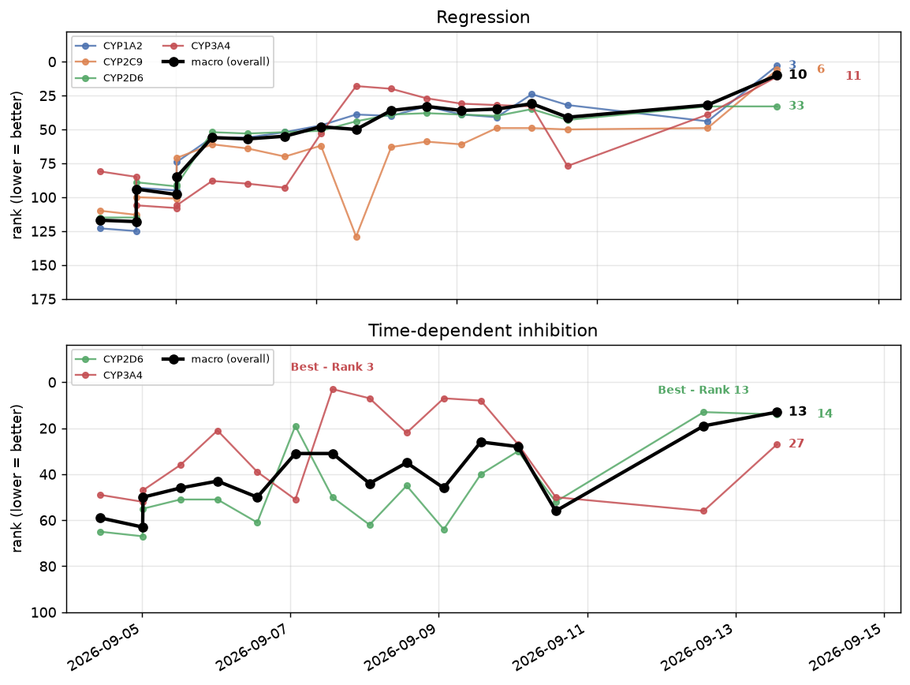
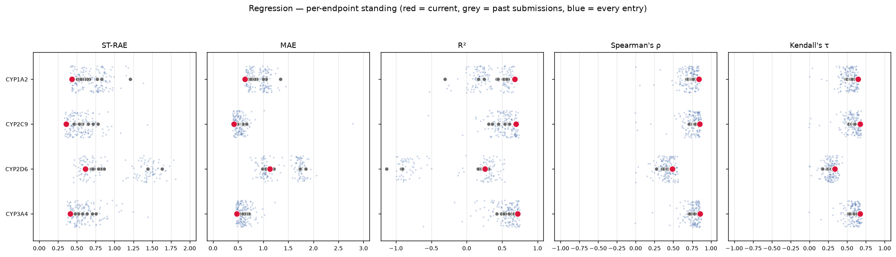
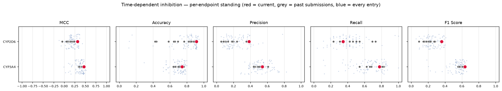
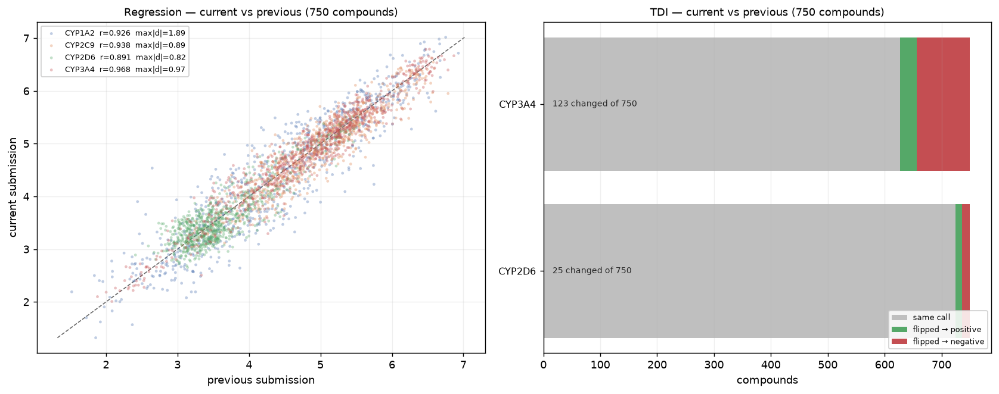

# OpenADMET CYP Inhibition Challenge

Stacked ensemble for the [OpenADMET CYP Inhibition Blind Challenge](https://huggingface.co/spaces/openadmet/cyp-challenge)
— **pIC50 regression** across four cytochrome P450 isoforms, and **time-dependent inhibition
(TDI)** classification for two of them.

Best standing to date: **macro rank 10 of 146** on the regression track, with three of the four
endpoints inside the top 11.

> Write-up only. This repository holds the method description and results; it is not the
> training code.

## Approach

A representation-diverse ensemble, stacked per endpoint.

| stage | what it does |
|---|---|
| **Base learners** | SMILES-sequence transformers, message-passing graph networks, 3D-conformer models, tabular in-context learners over frozen embeddings, a fingerprint baseline, and an additive-fragment model |
| **Auxiliary pretraining** | Masked multi-task pretraining on public bioactivity data, warm-starting each backbone before the high-fidelity fine-tune |
| **Blind-set neighbours** | Tens of thousands of near-neighbours of the held-out compounds, pulled from a large public chemical catalogue and screened before use, so every backbone sees the neighbourhood it will be scored in |
| **Cross-validation** | Butina cluster-disjoint folds — clusters assigned whole to a single fold, so no analogue series spans train and validation |
| **Stacking** | Per-endpoint comparison of ridge / elastic-net / non-negative / NNLS combiners, selected on held-out folds |

Every reported number is out-of-fold. Nothing is scored on data the base learners saw.

## Blind Challenge Competition - Current Leaderboard Standing

**Regression** (pIC50)

<table>
<thead>
<tr><th rowspan="2">Endpoint</th><th colspan="4">Metrics &mdash; held-out CV</th><th colspan="3">Ranking &mdash; of 155 entries</th></tr>
<tr><th>MAE</th><th>RMSE</th><th>R²</th><th>Spearman ρ</th><th>best</th><th>latest</th><th>percentile</th></tr>
</thead>
<tbody>
<tr><td>CYP1A2</td><td align="right">0.429</td><td align="right">0.589</td><td align="right">0.671</td><td align="right">0.777</td><td align="right">3</td><td align="right">5</td><td align="right">top 3%</td></tr>
<tr><td>CYP2C9</td><td align="right">0.327</td><td align="right">0.443</td><td align="right">0.667</td><td align="right">0.834</td><td align="right">6</td><td align="right">8</td><td align="right">top 5%</td></tr>
<tr><td>CYP2D6</td><td align="right">0.432</td><td align="right">0.658</td><td align="right">0.481</td><td align="right">0.792</td><td align="right">33</td><td align="right">39</td><td align="right">top 25%</td></tr>
<tr><td>CYP3A4</td><td align="right">0.349</td><td align="right">0.469</td><td align="right">0.813</td><td align="right">0.910</td><td align="right">16</td><td align="right">17</td><td align="right">top 11%</td></tr>
<tr><td><strong>macro average</strong></td><td align="right"><strong>0.384</strong></td><td align="right"><strong>0.540</strong></td><td align="right"><strong>0.658</strong></td><td align="right"><strong>0.828</strong></td><td align="right"><strong>13</strong></td><td align="right"><strong>16</strong></td><td align="right"><strong>top 10%</strong></td></tr>
</tbody>
</table>

**Time-dependent inhibition** (binary)

<table>
<thead>
<tr><th rowspan="2">Endpoint</th><th colspan="2">Metrics &mdash; held-out CV</th><th colspan="3">Ranking &mdash; of 85 entries</th></tr>
<tr><th>MCC</th><th>AUC</th><th>best</th><th>latest</th><th>percentile</th></tr>
</thead>
<tbody>
<tr><td>CYP2D6</td><td align="right">0.195</td><td align="right">0.622</td><td align="right">13</td><td align="right">14</td><td align="right">top 16%</td></tr>
<tr><td>CYP3A4</td><td align="right">0.496</td><td align="right">0.835</td><td align="right">3</td><td align="right">5</td><td align="right">top 6%</td></tr>
<tr><td><strong>macro average</strong></td><td align="right"><strong>0.346</strong></td><td align="right"><strong>&ndash;</strong></td><td align="right"><strong>6</strong></td><td align="right"><strong>6</strong></td><td align="right"><strong>top 7%</strong></td></tr>
</tbody>
</table>

## Leaderboard history

### Where this sits against the field

Every reported metric, every entry. Red is this submission, grey its predecessors, blue every
other entry on the board.

### What changed in the latest submission

## Chemical neighbourhood of the held-out set

The held-out compounds occupy a particular corner of chemical space, and the labelled training
data does not densely cover it. To close that gap, **over 50,000 near-neighbours of the held-out
structures** were retrieved from a large public catalogue — filtered at retrieval time to the
held-out set's own physicochemical envelope and screened for structural liabilities, then kept
only above a similarity floor chosen so that every admitted compound is closer to the scored
molecules than the training set's own average nearest neighbour.

They carry **no assay labels at all** — nothing was measured on them, and nothing is invented.
What they do carry is a *calculated physical property*, computed for every compound in the
project by one model so the value means the same thing on every row.

That single head is what lets them into training. Each backbone is pretrained multi-task with the
loss masked per head, so a row contributes through whichever heads it actually has: a measured
compound trains the assay heads, a neighbour trains only the physicochemical one. Without that
head a neighbour has no label in any task and is dropped before the first gradient step — with
it, the same rows warm-start the shared trunk on the chemistry surrounding the held-out
compounds.

So the neighbours do not teach the model about potency. They teach the *encoder* what this
region of chemical space looks like, before it ever sees a label from it — and the representation
the downstream heads are built on is fitted on that wider neighbourhood rather than only where
labels happen to exist.

## Structural alerts, vetoed by the held-out set

Auxiliary compounds are screened with [rd_filters](https://github.com/PatWalters/rd_filters) —
~1,150 named alerts across eight public rule sets. Selection is subtractive: every alert is on by
default, **any alert that fires on even one held-out compound is dropped** (75 of ~1,150), then a
frequency cut removes the rest of the long tail.

## Keeping any one learner from dominating

The ensemble mixes fine-tuned molecular encoders with **tabular foundation models fitted over
their frozen embeddings**. Those tabular legs are the ones that need holding back: they are cheap
to add, they fit held-out folds extremely well, and several of them read from the *same*
embeddings, so they arrive pre-correlated and can crowd out the encoders that produced their
input. Four controls, each added after measuring a failure rather than chosen up front.

**Non-negative stacking.** Residual correlations between members run ~0.55–0.88 — the shared
residual mostly tracks *which compounds are hard*, not which model is used. Given that,
unconstrained ridge and elastic-net combiners returned large cancelling coefficients: one member
near +1.9 against another at −0.6, and on one endpoint the best standalone model pushed
**negative**, used as a correction term rather than a predictor. That fits held-out folds and
transfers badly — one revision improved cross-validated error on all four endpoints while real
held-out error got *worse* on three. The stacker is now restricted to non-negative combiners,
which forbids the cancellation structurally instead of penalising it.

**A feature budget on the tabular legs.** Each embedding source is PCA-capped before it reaches a
tabular model. With only one to two thousand labelled rows per endpoint, an uncapped
concatenation of several thousand embedding dimensions lets those models memorise the fold rather
than learn from it.

**Per-source legs, not one opaque column.** Every embedding source is fitted on its own *and* in
the combined block, so the stacker can weigh one backbone's contribution against another's
directly instead of seeing a single blended tabular prediction it must take or leave whole.

**Pruning by correlation, not by count.** More members is not reliably better. Dropping a group of
highly-correlated tabular legs improved every endpoint at once; later, dropping
*representation-diverse* members cost most of that back. What matters is how much independent
signal a member adds — on the classification track the direct encoder heads individually
outranked every tabular embedding leg, and including all of them produced the worst result on
record for one endpoint.

**Down-weighted calculated features.** A property computed from structure alone carries a label on
every row, so at full weight it supplies the large majority of the pretraining gradient and the
trunk spends its capacity reproducing a function it can already derive. Those heads are
down-weighted as a per-task weight — a constant per-row weight cancels out of a weighted mean and
changes nothing.

## What moved the needle

- **Cluster-disjoint validation first.** Random splits flattered every model. Butina folds made
  the held-out numbers track the leaderboard, which is what made iteration meaningful at all.
- **Representation diversity beat single-model tuning.** The stacker consistently preferred a
  spread of molecular representations over more capacity in any one of them.
- **Auxiliary pretraining helps where labels are thin**, and the gain scales with how much of
  the corpus each head can actually see.
- **Calibration is separable from ranking.** Several learners ranked compounds well while being
  badly scaled; letting the stacker recalibrate recovered most of that.
- **TDI is a different problem from potency.** Features that predict inhibition strength carry
  little about time-dependent inactivation, which is mechanism-driven.

## Stack

RDKit · PyTorch · Chemprop · scikit-learn · HuggingFace Transformers · AutoGluon

*Open-source components only.*
