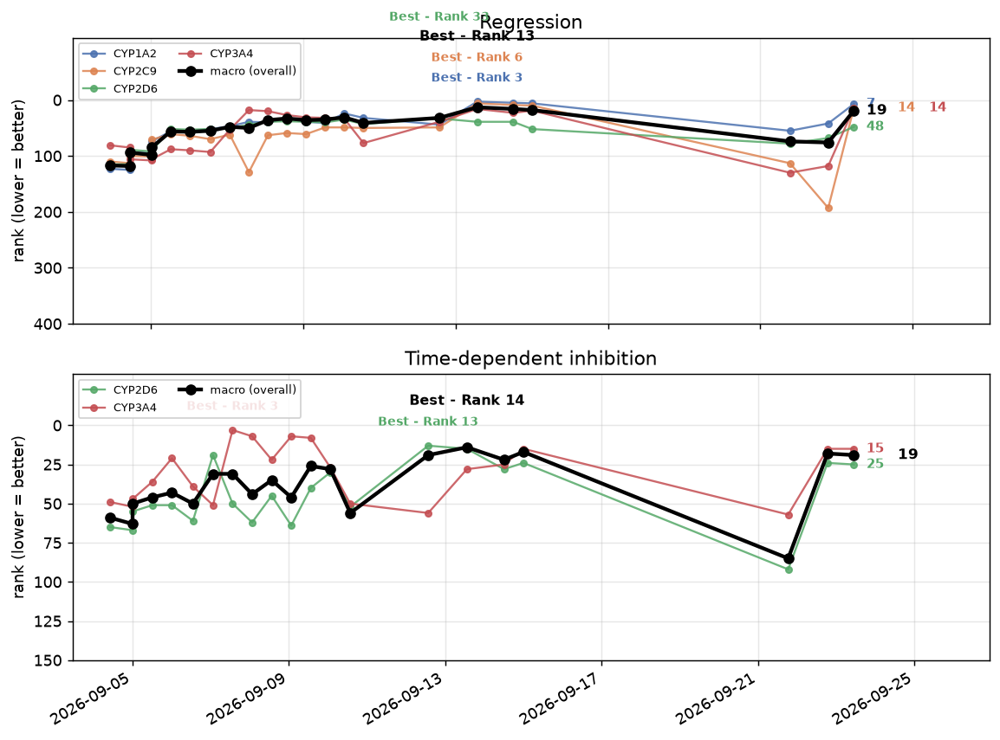
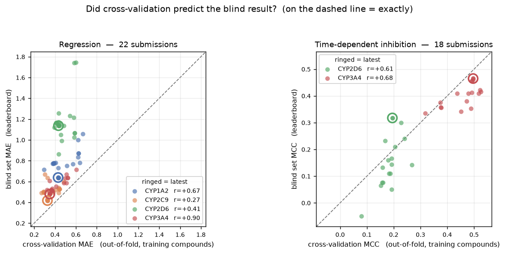
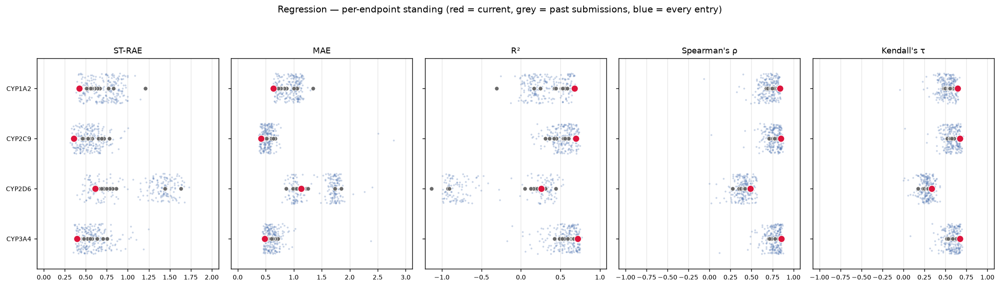
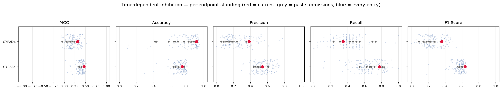
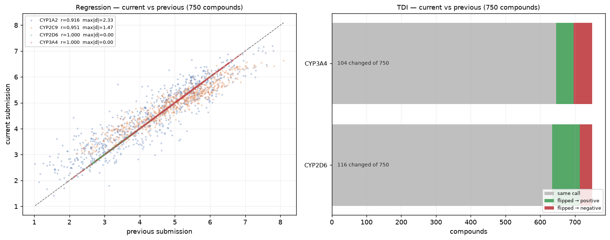
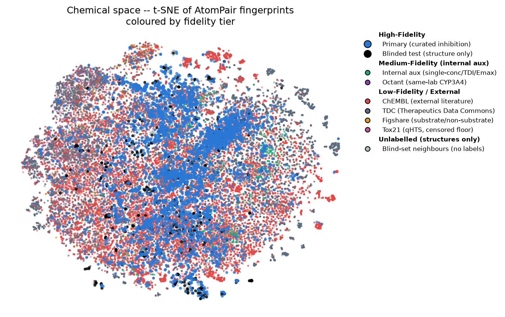

# OpenADMET CYP Inhibition Challenge

Stacked ensemble for the [OpenADMET CYP Inhibition Blind Challenge](https://huggingface.co/spaces/openadmet/cyp-challenge)
— **pIC50 regression** across four cytochrome P450 isoforms, and **time-dependent inhibition
(TDI)** classification for two of them.

On the organisers' **interim leaderboard** — scored on the *entire* held-out test set rather than the half the live board uses — this work placed **rank 28 of 219** on the regression track (Tier 6); and **rank 6 of 114** on the TDI track, inside **Tier 1** — the top tier, the 26 entries the organisers could not separate from first place.

> Write-up only. This repository holds the method description and results; it is not the
> training code.

## Approach

A representation-diverse ensemble, stacked per endpoint.

| stage | what it does |
|---|---|
| **Base learners** | SMILES-sequence transformers, message-passing graph networks, 3D-conformer models, tabular in-context learners over frozen embeddings, a fingerprint baseline, and an additive-fragment model |
| **Auxiliary pretraining** | Masked multi-task pretraining on public bioactivity data, warm-starting each backbone before the high-fidelity fine-tune |
| **Blind-set neighbours** | Tens of thousands of near-neighbours of the held-out compounds, pulled from a large public chemical catalogue and screened before use, so every backbone sees the neighbourhood it will be scored in |
| **Cross-validation** | Butina cluster-disjoint folds — clusters assigned whole to a single fold, so no analogue series spans train and validation |
| **Stacking** | Per-endpoint comparison of ridge / elastic-net / non-negative / NNLS combiners, selected on held-out folds |

Every reported number is out-of-fold. Nothing is scored on data the base learners saw.

## Blind Challenge Competition - Current Leaderboard Standing

**Regression** (pIC50)

<table>
<thead>
<tr><th rowspan="2">Endpoint</th><th colspan="3">Cross-validation &mdash; out-of-fold</th><th colspan="4">Blind set &mdash; interim board</th><th colspan="3">Ranking &mdash; live board, of 230 entries</th><th colspan="2">Ranking &mdash; interim board, of 219 entries</th></tr>
<tr><th>MAE</th><th>R²</th><th>Spearman ρ</th><th>ST-RAE</th><th>MAE</th><th>R²</th><th>Spearman ρ</th><th>best</th><th>latest</th><th>percentile</th><th>rank</th><th>percentile</th></tr>
</thead>
<tbody>
<tr><td>CYP1A2</td><td align="right">0.429</td><td align="right">0.671</td><td align="right">0.777</td><td align="right">0.441</td><td align="right">0.656</td><td align="right">0.660</td><td align="right">0.826</td><td align="right">3</td><td align="right">6</td><td align="right">top 3%</td><td align="right">30</td><td align="right">top 14%</td></tr>
<tr><td>CYP2C9</td><td align="right">0.327</td><td align="right">0.667</td><td align="right">0.834</td><td align="right">0.380</td><td align="right">0.480</td><td align="right">0.686</td><td align="right">0.851</td><td align="right">6</td><td align="right">10</td><td align="right">top 4%</td><td align="right">20</td><td align="right">top 9%</td></tr>
<tr><td>CYP2D6</td><td align="right">0.432</td><td align="right">0.481</td><td align="right">0.792</td><td align="right">0.653</td><td align="right">1.141</td><td align="right">0.290</td><td align="right">0.449</td><td align="right">33</td><td align="right">42</td><td align="right">top 18%</td><td align="right">37</td><td align="right">top 17%</td></tr>
<tr><td>CYP3A4</td><td align="right">0.349</td><td align="right">0.813</td><td align="right">0.910</td><td align="right">0.386</td><td align="right">0.475</td><td align="right">0.743</td><td align="right">0.863</td><td align="right">14</td><td align="right">14</td><td align="right">top 6%</td><td align="right">23</td><td align="right">top 11%</td></tr>
<tr><td><strong>macro average</strong></td><td align="right"><strong>0.384</strong></td><td align="right"><strong>0.658</strong></td><td align="right"><strong>0.828</strong></td><td align="right"><strong>0.465</strong></td><td align="right"><strong>0.688</strong></td><td align="right"><strong>0.595</strong></td><td align="right"><strong>0.747</strong></td><td align="right"><strong>13</strong></td><td align="right"><strong>21</strong></td><td align="right"><strong>top 9%</strong></td><td align="right"><strong>28</strong></td><td align="right"><strong>top 13%</strong></td></tr>
</tbody>
</table>
<p><em>The two ranking groups are different boards and their percentiles are not comparable: the live leaderboard scores half the held-out set, the <strong>interim</strong> board scores all of it. The macro row there sits in <strong>Tier 6</strong> of their significance tiering.</em></p>

**Time-dependent inhibition** (binary)

<table>
<thead>
<tr><th rowspan="2">Endpoint</th><th colspan="2">Cross-validation &mdash; out-of-fold</th><th colspan="3">Blind set &mdash; interim board</th><th colspan="3">Ranking &mdash; live board, of 129 entries</th><th colspan="2">Ranking &mdash; interim board, of 114 entries</th></tr>
<tr><th>MCC</th><th>AUC</th><th>MCC</th><th>Accuracy</th><th>F1</th><th>best</th><th>latest</th><th>percentile</th><th>rank</th><th>percentile</th></tr>
</thead>
<tbody>
<tr><td>CYP2D6</td><td align="right">0.268</td><td align="right">0.711</td><td align="right">0.256</td><td align="right">0.918</td><td align="right">0.298</td><td align="right">13</td><td align="right">31</td><td align="right">top 24%</td><td align="right">26</td><td align="right">top 23%</td></tr>
<tr><td>CYP3A4</td><td align="right">0.437</td><td align="right">0.805</td><td align="right">0.504</td><td align="right">0.761</td><td align="right">0.671</td><td align="right">3</td><td align="right">19</td><td align="right">top 15%</td><td align="right">3</td><td align="right">top 3%</td></tr>
<tr><td><strong>macro average</strong></td><td align="right"><strong>0.353</strong></td><td align="right"><strong>0.758</strong></td><td align="right"><strong>0.380</strong></td><td align="right"><strong>0.840</strong></td><td align="right"><strong>0.484</strong></td><td align="right"><strong>14</strong></td><td align="right"><strong>26</strong></td><td align="right"><strong>top 20%</strong></td><td align="right"><strong>6</strong></td><td align="right"><strong>top 5%</strong></td></tr>
</tbody>
</table>
<p><em>The two ranking groups are different boards and their percentiles are not comparable: the live leaderboard scores half the held-out set, the <strong>interim</strong> board scores all of it. The macro row there sits in <strong>Tier 1</strong>, the top tier &mdash; the 26 entries they could not separate from first place.</em></p>

## Leaderboard history



*Coloured lines are the live leaderboard, which scores half the held-out set and moves with every
submission. The dashed vertical rule marks the release of the interim leaderboard, scored on the
whole set; each line continues to its own standing there, with the overall result in purple.*

### Did cross-validation predict the blind result?

Held-out cross-validation is the only signal available while a challenge is running, so it is
worth asking how much of it survived contact with the blind set. The two are **not** the same
measurement. The cross-validated value is out-of-fold over roughly 1,200–2,200 *training*
compounds under cluster-disjoint folds; the blind value is what that same submission scored on
the 750 held-out compounds, which the organisers built by expanding the most potent training
hits into close analogues. Different compounds, deliberately a different distribution — so a
gap is expected, and its size and sign are the interesting part.

Every submission is plotted, one point per endpoint, on each track's ranking statistic.
Regression is shown as MAE rather than the board's own ST-RAE: that statistic is the
organisers' and has no cross-validated counterpart here, so pairing it against anything of ours
would put two different quantities on one axis.



Reading the figure: on **regression**, 100% of submission-endpoint pairs came out worse on the blind set than in cross-validation (median MAE +0.208); on **TDI**, 81% of submission-endpoint pairs came out worse on the blind set than in cross-validation (median MCC -0.036).

Correlations are quoted per endpoint on purpose. Pooling them measures the gap *between*
endpoints rather than whether cross-validation tracked a submission's progress — pooled, MCC
reads r = 0.90, while neither endpoint on its own exceeds 0.69.

### Where this sits against the field

Every reported metric, every entry. Red is this submission, grey its predecessors, blue every
other entry on the board.





### What changed in the latest submission



## Chemical neighbourhood of the held-out set

The held-out compounds occupy a particular corner of chemical space, and the labelled training
data does not densely cover it. To close that gap, **88,683 near-neighbours of the held-out
structures** were retrieved from a large public catalogue — filtered at retrieval time to the
held-out set's own physicochemical envelope and screened for structural liabilities, then kept
only above a similarity floor chosen so that every admitted compound is closer to the scored
molecules than the training set's own average nearest neighbour. The **4,999 closest** are
admitted to the training pool, entering with only their calculated physical properties and no
assay endpoints.



*Chemical space of the corpus, t-SNE of AtomPair fingerprints, coloured by data tier. The
held-out compounds are black and the admitted neighbours are their own tier, so how closely the
retrieved chemistry tracks the scored compounds can be read off the map directly.*

## Structural alerts, vetoed by the blind held-out set

Auxiliary compounds are screened with [rd_filters](https://github.com/PatWalters/rd_filters) —
~1,150 named alerts across eight public rule sets. Selection is subtractive: every alert is on by
default, **any alert that fires on even one held-out compound is dropped** (~75 of 1249), then a
frequency cut removes the rest of the long tail.

## Keeping any one learner from dominating

The ensemble mixes fine-tuned molecular encoders with **tabular foundation models fitted over
their frozen embeddings**. Those tabular legs are the ones that need holding back: they are cheap
to add, they fit held-out folds extremely well, and several of them read from the *same*
embeddings, so they arrive pre-correlated and can crowd out the encoders that produced their
input. Four controls, each added after measuring a failure rather than chosen up front.

**Non-negative stacking.** Residual correlations between members run ~0.55–0.88 — the shared
residual mostly tracks *which compounds are hard*, not which model is used. Given that,
unconstrained ridge and elastic-net combiners returned large cancelling coefficients: one member
near +1.9 against another at −0.6, and on one endpoint the best standalone model pushed
**negative**, used as a correction term rather than a predictor. That fits held-out folds and
transfers badly — one revision improved cross-validated error on all four endpoints while real
held-out error got *worse* on three. The stacker is now restricted to non-negative combiners,
which forbids the cancellation structurally instead of penalising it.

**A feature budget on the tabular legs.** Each embedding source is PCA-capped before it reaches a
tabular model. With only one to two thousand labelled rows per endpoint, an uncapped
concatenation of several thousand embedding dimensions lets those models memorise the fold rather
than learn from it.

**Per-source legs, not one opaque column.** Every embedding source is fitted on its own *and* in
the combined block, so the stacker can weigh one backbone's contribution against another's
directly instead of seeing a single blended tabular prediction it must take or leave whole.

**Pruning by correlation, not by count.** More members is not reliably better. Dropping a group of
highly-correlated tabular legs improved every endpoint at once; later, dropping
*representation-diverse* members cost most of that back. What matters is how much independent
signal a member adds — on the classification track the direct encoder heads individually
outranked every tabular embedding leg, and including all of them produced the worst result on
record for one endpoint.

**Down-weighted calculated features.** A property computed from structure alone carries a label on
every row, so at full weight it supplies the large majority of the pretraining gradient and the
trunk spends its capacity reproducing a function it can already derive. Those heads are
down-weighted as a per-task weight — a constant per-row weight cancels out of a weighted mean and
changes nothing.

## Tabular foundation models

The frozen-embedding learners are fitted with **Mitra**, AutoGluon's tabular foundation model,
released under Apache 2.0. Two comparable models were evaluated on identical embeddings, TabICL
and TabPFN. TabPFN was omitted.

```python
from autogluon.tabular.configs.hyperparameter_configs import get_hyperparameter_config

ag_hp = get_hyperparameter_config("zeroshot_2025_tabfm")
for m in ["TABPFNV2"]:
    ag_hp.pop(m, None)
```

Across seven matched embedding sources Mitra beat TabPFN on macro held-out R² in six, and the
two models' residuals correlated 0.94–0.98 — they were making very nearly the same mistakes, so
leaving one out cost almost no ensemble diversity.

> Zhang, X., Maddix, D. C., Yin, J., Erickson, N., Ansari, A. F., Han, B., Zhang, S., Akoglu, L.,
> Faloutsos, C., Mahoney, M. W., Hu, C., Rangwala, H., Karypis, G., & Wang, B. (2025).
> *Mitra: Mixed Synthetic Priors for Enhancing Tabular Foundation Models.* NeurIPS 2025.
> [arXiv:2510.21204](https://arxiv.org/abs/2510.21204) ·
> [AutoGluon](https://github.com/autogluon/autogluon), Apache 2.0

## What moved the needle

- **Cluster-disjoint validation first.** Random splits flattered every model. Butina folds made
  the held-out numbers track the leaderboard, which is what made iteration meaningful at all.
- **Representation diversity beat single-model tuning.** The stacker consistently preferred a
  spread of molecular representations over more capacity in any one of them.
- **Auxiliary pretraining helps where labels are thin**, and the gain scales with how much of
  the corpus each head can actually see.
- **Calibration is separable from ranking.** Several learners ranked compounds well while being
  badly scaled; letting the stacker recalibrate recovered most of that.
- **TDI is a different problem from potency.** Features that predict inhibition strength carry
  little about time-dependent inactivation, which is mechanism-driven.

## Stack

RDKit · PyTorch · Chemprop · scikit-learn · HuggingFace Transformers · AutoGluon

*Open-source components only.*
